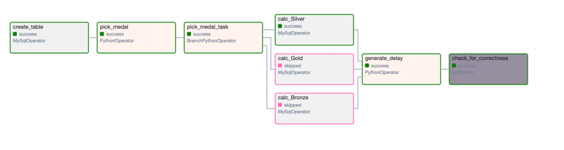
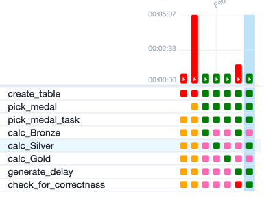
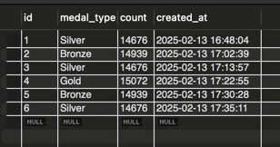

# goit-de-hw-07
The DAG consists of 8 tasks:

Only 6 can be run in at once, because there is a branching part with 3 tasks.
1. The first task creates a table if it does not exist.
2. The second task is a python operator that picks medal rank randomly and pushes it to XCom.
3. The third task is a branchin operator. It pulls the medal rank from XCom and decides which task to run next based on the rank.
4. Then there are 3 similar tasks. They are MySQL operators that calculate the number of corresponding
medals in one table and writes the result to another table.
5. The fifth task creates a time delay to demo the 6th task.
6. The sixth task is SQL sensor which checks if the last record in the table is not old enough. It fails if time delay is longer
than its threshold or runs successfully otherwise.
The last run it was completed successfully and the run before that it failed.

The records are created in the table:

